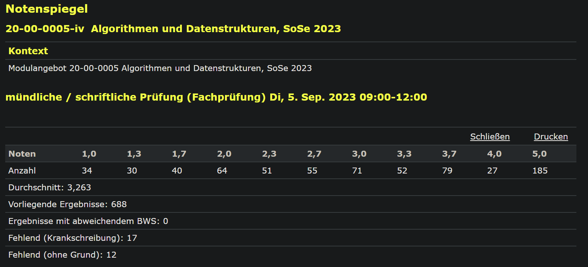

# 🎓 AUD Grade Estimator (OCR-Powered)

This project is a Flask web application that aggregates historical grade distribution data for the **Algorithmen und Datastrukturen (AUD)** course at TU Darmstadt. It extracts student counts directly from exam result screenshots using **Optical Character Recognition (OCR)** to provide a percentage-based goal grade estimator.

---

## 🚀 Key Features

* **OCR Data Ingestion:** Scans and processes image files (`.png`, `.jpg`) stored in the **`AUD/`** folder.
* **Targeted Extraction:** Uses OpenCV and Tesseract to locate the "Anzahl" line and extract the 10 student counts corresponding to grades **1.0** through **4.0**.
* 

* **Cumulative Statistics:** Aggregates all scanned semesters (`SoSe23`, `WiSe2425`, etc.) for robust historical data.
* **Web Estimator:** A simple interface where users select a target grade and receive the **percentage of students who achieved that grade or better**.

---

### Critical Dependency: Tesseract OCR Engine

The application **requires** the Tesseract OCR engine executable to be installed on your system for `pytesseract` to function.

* **Windows:** Install Tesseract from the [official installer page](https://github.com/UB-Mannheim/tesseract/wiki).
* **Linux (Debian/Ubuntu):** `sudo apt install tesseract-ocr`
* **macOS (Homebrew):** `brew install tesseract`

---

## 🛠️ Setup and Installation

1.  **Clone the Repository:**
    ```bash
    git clone [your-repo-link]
    cd [your-project-folder]
    ```

2.  **Install Python Dependencies:**
    You'll need the packages listed in `requirements.txt`:
    ```bash
    pip install -r requirements.txt
    ```

---

## ▶️ Running the Application

1.  **Start the Server:** Run the main application script.
    ```bash
    python main.py
    ```
2.  **OCR Initialization:** The script will immediately execute `init_data_from_images()`, scanning the images in the `AUD/` folder. Check your console for log messages confirming the data extraction.
3.  **Access the Estimator:** Open your browser and navigate to:
    `http://127.0.0.1:5000/estimator`

---

## 🧠 Calculation Logic

When a user selects a goal grade (e.g., $G_{\text{target}}$), the system calculates the percentage of students who achieved a grade **equal to or better** than that target.

$$\text{Success Rate} = \left( \frac{\sum \text{Students with Grade} \le G_{\text{target}}}{\text{Total Students Scanned}} \right) \times 100$$

This provides a historically grounded estimate of the likelihood of achieving your goal.

## 📚 Resources & Acknowledgements

This project was built using several key resources and tutorials for integrating complex technologies like OCR and Docker. Special thanks to the creators of these guides:

- **Tesseract/OpenCV Integration:** The core logic for image preprocessing and grade extraction was heavily informed by [this guide on advanced pytesseract usage](https://nanonets.com/blog/ocr-with-tesseract/).
- **Flask in Docker:** The configuration for ensuring the Flask development server runs correctly inside the container (binding to `0.0.0.0` and setting up the `Dockerfile` structure) was learned from the [Official Docker Python Guide](https://docs.docker.com/language/python/) and YouTube.

